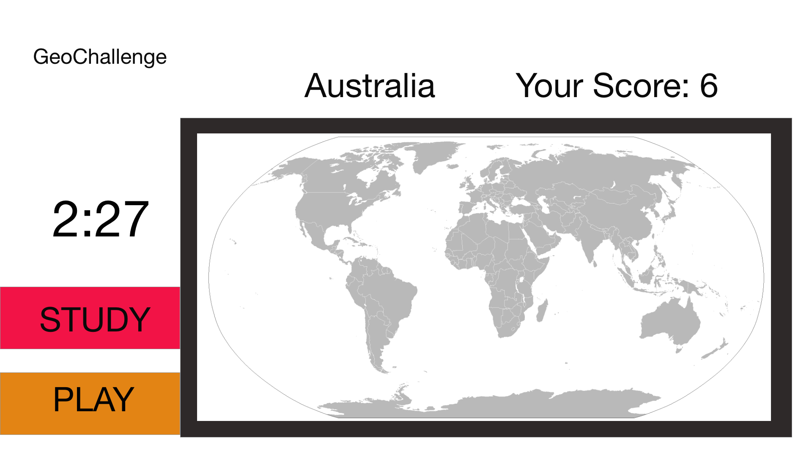

## GeoChallenge - Test your geography knowledge!

### Background and Overview

GeoChallenge is a map-based quiz and learning system. User will have access to a world map and can click on any country to get it's name. User's can play in game mode with a time limit to locate the country when prompted. Score is kept.

### Functionality & MVP  

In GeoChallenge, users will be able to:

- [ ] Create a world map that can respond to user interaction.
- [ ] Respond accordingly base on user's clicks by updating scores.  
- [ ] Randomly generate country names to use in quiz mode.
- [ ] Be able to play a game that resets.
- [ ] Study mode will allow users to see the name of the country when clicking on its geographical area.

### Wireframes

This app will consist of a single screen with a map, timer, country name display, and study mode button.

### Architecture and Technologies

This project will be implemented with the following technologies:

- Vanilla JavaScript for overall structure and game logic,
- `HTML5 Canvas` for DOM manipulation and rendering,
- d3.js library for geographical information

### Implementation Timeline

**Over the weekend**:
- [x] Decide which technologies to use and determine necessary tutorial material

**Day 1**: Setup all necessary Node modules, including getting webpack up and running.  Create `webpack.config.js` as well as `package.json`.  Write a basic entry file.  Goals for the day:

- [x] Get `webpack` serving files and frame out index.html
- [x] Learn how to render a map on the MIT d3.js tutorial http://duspviz.mit.edu/tutorials/

**Day 2**: Complete a basic world map that can handle user interaction.
- [x] Learn how to render map (continued)
- [x] Learn how to use event listeners to map

**Day 3**: Create the game logic for keeping points and a timer.

**Day 4**: Continue working on the game logic and styling

- [x] Have a styled `Canvas`, nice looking controls and title
